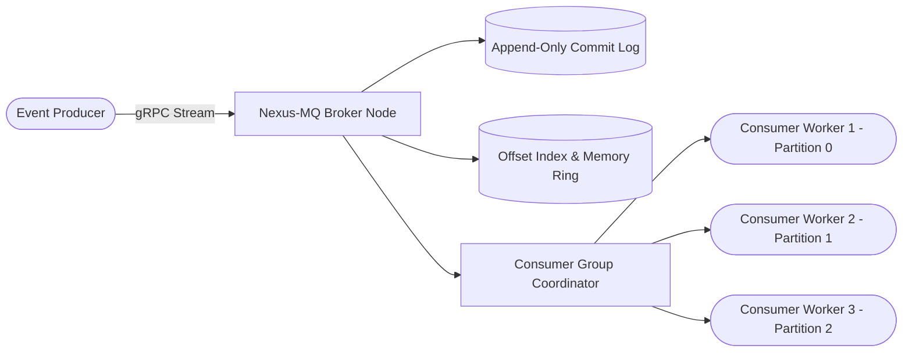

# ⚡ NexusMQ




[](https://github.com/txltedxgod/nexus-mq/actions)
[](https://opensource.org/licenses/MIT)
[](https://golang.org/)
[](https://grpc.io/)


[](https://github.com/txltedxgod/nexus-mq/actions)
[](https://goreportcard.com/report/github.com/txltedxgod/nexus-mq)
[](LICENSE)
[](https://go.dev/)

**NexusMQ** is a high-throughput, distributed event-streaming engine and lightweight commit-log message broker engineered in Go. It delivers low-latency persistence, dynamic partition sharding, consumer group coordination, and a built-in real-time monitoring dashboard.

---

## 🌟 Key Architecture & Highlights

```
                       ┌──────────────────────────────────────────────┐
                       │                   NexusMQ                    │
[Producers] ─────────> │  HTTP REST / TCP Ingestion Gateway           │
                       │   ├── Partition Router (Hash / Round-Robin)  │
                       │   │                                          │
                       │   └── Partition Commit Log                   │
                       │        ├── Segment 000.log + 000.idx (mmap)  │
                       │        ├── Segment 001.log + 001.idx         │
                       │        └── CRC32 Checksum Verification       │
                       │                                              │
[Consumers] <───────── │  Consumer Group Coordinator (Rebalancing)    │
                       │   ├── Committed Offsets Tracking             │
                       │   └── Heartbeat & Liveness Watcher           │
                       └──────────────────────┬───────────────────────┘
                                              │
                                   [Web Dashboard & Prometheus]
```

- **Segmented Commit Log with Sparse Indexing:** High-speed sequential write throughput with zero-overhead binary index lookups.
- **Dynamic Partitioning & Hash Sharding:** Distribute high-volume streams across configurable partition pools.
- **Consumer Group Rebalancing:** Native consumer group protocol supporting automatic partition assignment, heartbeats, and committed offset checkpoints.
- **Built-in Web Dashboard:** Live real-time dashboard showing throughput, partition lag, and cluster health.
- **Prometheus Exporter:** First-class `/metrics` endpoint for Grafana observability.

---

## 🚀 Quick Start

### 1. Run with Docker Compose
```bash
git clone https://github.com/txltedxgod/nexus-mq.git
cd nexus-mq
docker compose up -d
```
Open your browser at **`http://localhost:8080`** to view the live dashboard.

### 2. Build & Run Locally
```bash
# Start Broker
go run ./cmd/server -http-addr=:8080 -data-dir=./nexus-data

# Run High-Throughput Producer Benchmark
go run ./cmd/producer -topic=orders -messages=50000 -concurrency=8

# Stream Consumer
go run ./cmd/consumer -topic=orders -partition=0
```

---

## 📡 API Reference

### Publish Message
```http
POST /api/v1/produce
Content-Type: application/json

{
  "topic": "events.telemetry",
  "partition": -1,
  "key": "sensor-104",
  "value": "{\"temperature\": 24.8, \"humidity\": 62}",
  "headers": { "region": "eu-central-1" }
}
```

### Consume Messages
```http
GET /api/v1/consume?topic=events.telemetry&partition=0&offset=0&limit=100
```

### Prometheus Metrics
```http
GET /metrics
```

---

## 🧪 Testing

```bash
go test -v -race ./...
```

---

## 📄 License
Released under the [MIT License](LICENSE).